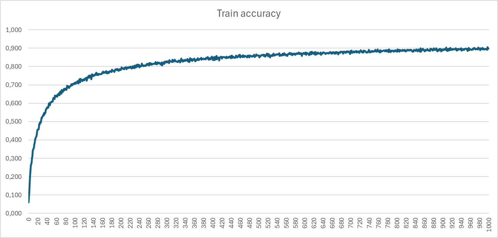
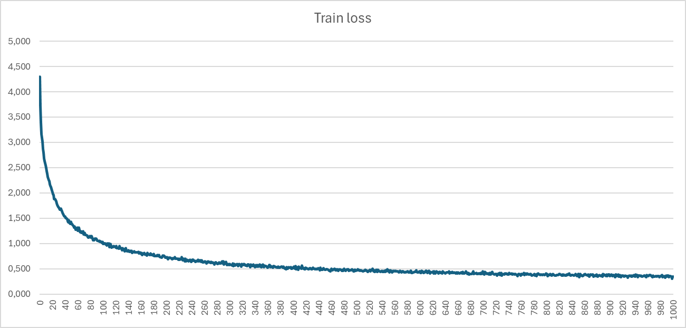
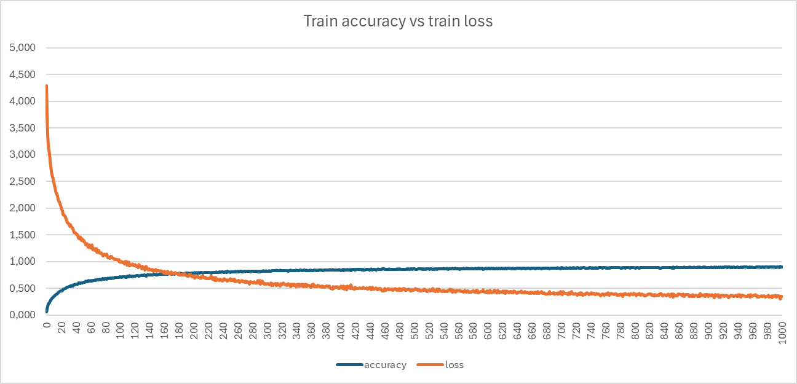
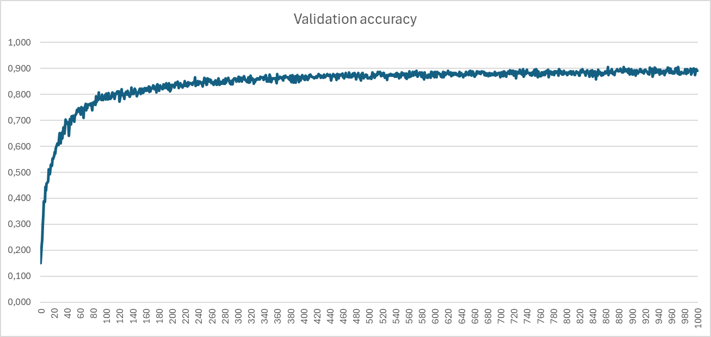
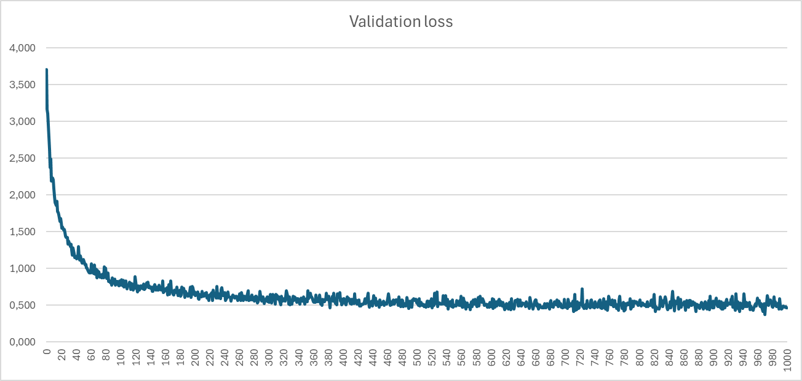
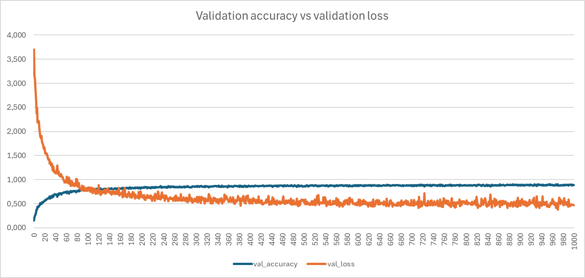
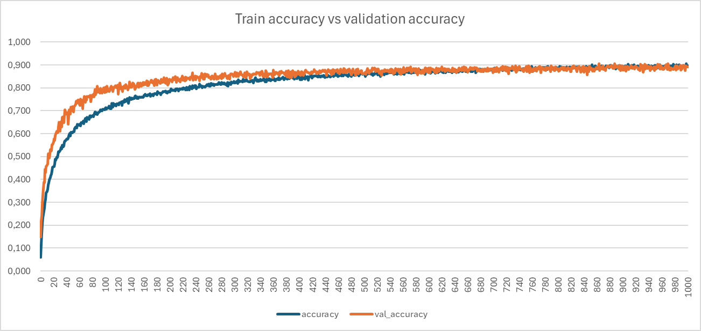
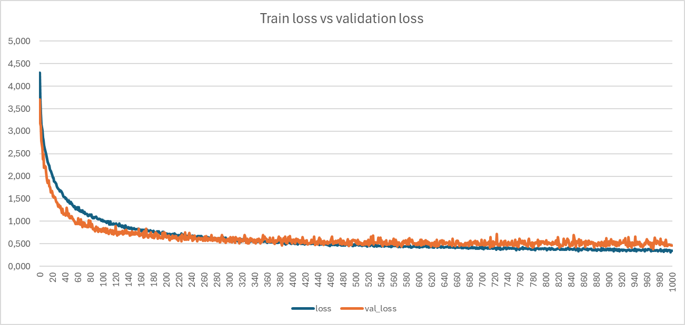

# Classification Model

## Data set

Collection includes 100 types of flowers, each with 50-150 images:

```
Flowers
    │   ├── Adenium Obesum
    │   |   ├── photo_001.jpg  
    │   |   ├── photo_002.jpg  
    │   |   ├── photo_003.jpg  
    |   | [...]
    │   |   ├── photo_119.jpg  
    │   |   └── photo_120.jpg  
    │   ├── Alstroemeria
    │   ├── Amaryllis
    │   ├── Anemone
    | [...]
    │   ├── Tricyrtis
    │   ├── Tropaeolum Majus
    │   ├── White Gaura
    │   └── Yellow Iris
```

Link to the flowers data-set: https://shorturl.at/B1349

## Model 

Link to the trained model: https://shorturl.at/gmSWX

### Convolution network structure: 

```python
def improved_vgg16(num_classes, d, e, m):
    model = Sequential()

    model.add(Conv2D(32, (3, 3), activation='relu', input_shape=(250, 250, 3)))
    model.add(MaxPooling2D((2, 2)))
    model.add(BatchNormalization(momentum=m, epsilon=e))

    model.add(Conv2D(64, (3, 3), activation='relu'))
    model.add(MaxPooling2D((2, 2)))
    model.add(BatchNormalization(momentum=m, epsilon=e))

    model.add(Conv2D(128, (3, 3), activation='relu'))
    model.add(MaxPooling2D((2, 2)))
    model.add(BatchNormalization(momentum=m, epsilon=e))

    model.add(Flatten())
    model.add(Dense(512, activation='relu'))
    model.add(Dropout(d))
    model.add(Dense(256, activation='relu'))
    model.add(Dense(num_classes, activation='softmax'))

    optimizer = Adam(learning_rate=0.0005)
    model.compile(loss='categorical_crossentropy', optimizer=optimizer, metrics=['accuracy'])

    model.summary()

    return model
```

### Results received by the model during training are shown below:










### Final results of model training:
- Accuracy: **0.898** [**89.8%**]
- Loss: **0.349** [**034.9%**]
- Validation accuracy: **0.906** [**90.6%**]
- Validation loss: **0.374** [**37.4%**]
